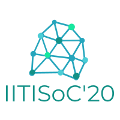

# **IITISoC'20** 

> IITISoC'20 is the annual dev Fest of IIT Indore to introduce the students to Software development and open source. The student work upon multiple open source project and they are mentored by experienced developers. The pattern followed by IITISoC is similar to GSoC so that the students get an idea of what GSoC is and how it works. 
---

## ORGANISERS AND COORDINATORS
### [Programming Club IIT Indore](http://progclub.iiti.ac.in/)
* [Anmol Gomra](https://Github.com/pineapple45) (President)
* [Miten Shah](https://github.com/mtnshh) (President)
---
    

## PROJECT LIST
1. [Hostel attendance system](https://github.com/kushaangowda/IITISoC---Attendance-Tool)
    * #### *Contributers*
        > * [Kushaan Gowda](https://Github.com/kushaangowda)
        > * [ Vaibhav Chandra](https://Github.com/vaibhavviking)
        > * [Ashwin]()
        > * [Hasan]()
        > * [Gautam]()
        > * [Satyabhagavan]()
    * #### *Mentors*
        > * [Anmol Gomra](https://Github.com/pineapple45)
1. [Face Recognition using Siamese Network](https://github.com/Team-Ragnarok/Face_Detection)
     * #### *Contributers*
        > * [Aryan Rastogi](https://Github.com/aryan-r22)
        > * [Aditya Bharadwaj]()
        > * [Ashish Gautam](https://Github.com/geek-ash)
        > * [Bharat Gupta](https://Github.com/bharat18001)
        > * [Purnadip Chakrabarti](https://Github.com/ChakPC)
        > * [Vardhan Paliwal](https://Github.com/Vardhan-08)
    * #### *Mentors*
        > * [Pranshu Maheshwari](https://Github.com/pranshumaheshwari)
        > * [Aditi Chauhan](https://Github.com/aditi1709)

1. [LA-Fresco in Pocket](https://github.com/BugsBunny1812/LA-Fresco-In-Pocket)
    * #### *Contributers*
        > * [Lokesh Singla](https://Github.com/lokesh-singla)
        > * [Krishanu Saini](https://Github.com/krishanu-2001)
        > * [Harshit Diyundi](https://Github.com/BugsBunny1812)
        > * [Abhishek Bansal](https://github.com/abhishek593)
        > * [Abhinav Aman](https://github.com/abhinav29aman)
        > * [Amit Anand](https://github.com/anandamit07)
        > * [Yash Suvarna](https://github.com/yshsuvarna)
    * #### *Mentors*
        > * [Akshay Prakash](https://Github.com/Aksh7706)
1. [Covid-19 Live Tracker](http://github.com/pranjall29/covid-19-project)
    * #### *Contributers*
        > * [Pranjal Gadge](https://Github.com/pranjall29)
        > * [Brahmadev Rai Shrivastava](https://Github.com/BruhMadev)
        > * [Yuvraj Singh](https://Github.com/radicalidol)
        > * [Vishal Thakre](https://github.com/the-thakre)
        > * [Abhinav Aman](https://github.com/abhinav29aman)
        > * [Mithila Sonar](https://github.com/Mithila28)
        > * [Rashtra Damahe](https://github.com/rashtra83)
    * #### *Mentors*
        > * [Mrigank Krishan](https://Github.com/Mrigank11)
1. [GreasySpoon](https://github.com/akashg3627/greasyspoon/)
    * #### *Contributers*
        > * [Akash Gupta](https://Github.com/akashg3627)
        > * [Dipin Garg](https://Github.com/dgargdipin)
        > * [Harsh Kushwaha](https://Github.com/hk-2102)
        > * [Siddesh Shelke](https://github.com/sids-09)
    * #### *Mentors*
        > * [Anmol Gomra](https://Github.com/pineapple45)
        > * [Gaurav Kumar](https://Github.com/Gaurav1327)
1. [eDOC@IITI](https://github.com/im-world/eDoc-IITI)
     * #### *Contributers*
        > * [Eshaan Sachdeva](https://Github.com/sachdevaeshaan)
        > * [Ashish raj](https://Github.com/AshishRajIITI)
        > * [Priyal dubey](https://Github.com/priyalweb)
        > * [Vineet Tripathi](https://github.com/vineet-chelsea)
        > * [Siddhant Rathi]()
        > * [Sagar Shirish Joshi]()
        > * [Mounika](https://Github.com/67456039)
    * #### *Mentors*
        > * [Sarthak Jain](https://Github.com/jains8844)
        > * [Anmol Gomra](https://Github.com/pineapple45)
1. [3dVolume-Area Calculator](https://github.com/gg-dev-05/3dVolume-Area)
     * #### *Contributers*
        > * [Jigyanshu](https://Github.com/Jigyanshu26)
        > * [Harsh](https://Github.com/harshb910)
        > * [Garvit Galgat](https://Github.com/gg-dev-05)
        > * [Somya Mehta]()
        > * [Divyansh Maheshwari]()
        > * [Anushk Gautam]()
    * #### *Mentors*
        > * [Adarsh Baghel](https://Github.com/Amagnum)
        > * [Harshil Bhavsar](https://Github.com/bhavsarharshil)

1. [Contest tracker](https://github.com/Darkrevenger-crypto/Contest)
    * #### *Contributers*
        > * [Vivek Bhushan](https://Github.com/vvkbhshn)
        > * [Rahul Kumar](https://Github.com/ronnie-36)
        > * [Neelanshu Garg](https://Github.com/Darkrevenger-crypto)
        > * [Tushar Tiwari](https://Github.com/tushartiwariofficial)
        > * [Piyush Pachori](https://Github.com/piyush8822)
        > * [Bhoomil Gohel](https://Github.com/bhoomilsgohel)
        > * [Anubhav Singh](https://Github.com/singh_anubhav)
        > * [Neel Parikh](https://Github.com/neel_951)
        > * [Manav Trivedi](https://Github.com/manavstg2)
        > * [Sudhanshu](https://Github.com/papaishere)
    * #### *Mentors*
        > * [Saloni Sawarkar](https://Github.com/Salonii02 )
        > * [Anmol Gomra](https://Github.com/pineapple45)
1. [Responsive image gallery](https://github.com/pineapple45/IITISoC---Responsive-Image-gallery)
    * #### *Contributers*
        > * [Sumer Thakur](https://Github.com/SumerThakur)
        > * [Kuldeep Singh](https://Github.com/Kuldeep28-star)
        > * [Mohit Kumar](https://Github.com/kumarmohit-28)
        > * [Shreya Deep](https://Github.com/ayerhs7)
        > * [Anjali Singhal](https://Github.com/anjiii-18)
        > * [Sakshi Verma](https://Github.com/SV-0)
        > * [Sakshi Pandey](https://Github.com/sakshi012000)
        > * [Pallavi Upadhyay](https://Github.com/pallavi-1812)
    * #### *Mentors*
        > * [Anmol Gomra](https://Github.com/pineapple45)
1. [Locating Blood Donation Centre](https://github.com/anjali7786/Blood-Bank.git)
    * #### *Contributers*
        > * [Anjali Gupta](https://Github.com/anjali7786)
        > * [Anupama Sureshbabu K.](https://Github.com/ankh77sb)
        > * [Rama Edlabadkar.  ](https://Github.com/skybluee2001)
        > * [Lekshmi S sunil](https://Github.com/lekshmissunil)
        > * [Rahul Kumar](https://Github.com/rahul11820)
        > * [Shubham Nimesh](https://Github.com/SV-0)
    * #### *Mentors*
        > * [Abhishek Kumar](https://Github.com/abhishek-kr-01)
1. [Android smart school system](https://github.com/supersaiyan1033/Android_smartschool_system)
    * #### *Contributers*
        > * [Makula Nitin Krishna](https://Github.com/supersaiyan1033)
        > * [Revanth thota](https://Github.com/revanththota)
        > * [Abhiram khajjayam](https://Github.com/Abhiram0201)
        > * [Kola sai ram]()
        > * [Digvijay Singh Rathore](https://Github.com/CoderRaja1234)
        > * [Harshwardhan Agrawal](https://Github.com/derco19)
        > * [Yash Gupta ](https://Github.com/yash352)
        > * [Atul Prajapati](https://Github.com/Atul-source)
    * #### *Mentors*
        > * [Adarsh Baghel](https://Github.com/Amagnum)
        > * [Harshil Bhavsar](https://Github.com/bhavsarharshil)
1. [Online Code Editor](https://github.com/Vinesh0299/online-code-editor)
    * #### *Contributers*
        > * [Anushka Paul](https://Github.com/anushka1309paul )
        > * [Deepika Sukhija](https://Github.com/DEEPIKA-SUK)
        > * [Deepali Sukhija](https://Github.com/DEEPALI-SUK)
        > * [Vinesh Katewa](https://github.com/vinesh0299)
        > * [Rhisav Raj](http://github.com/Rishavraj99)
        > * [Rohit Bankar](https://github.com/RohitBankar17)
        > * [Rishabh Kumar yadav](https://github.com/rky673)
    * #### *Mentors*
        > * [Adarsh Baghel](https://Github.com/Amagnum)
        > * [Gaurav Kumar](https://Github.com/Gaurav1327)